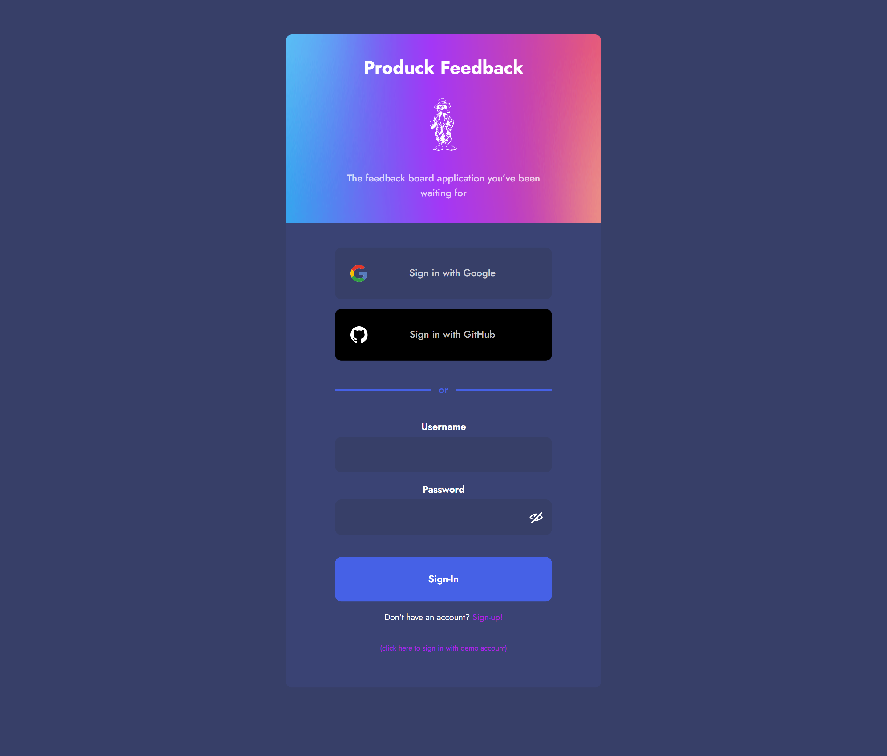
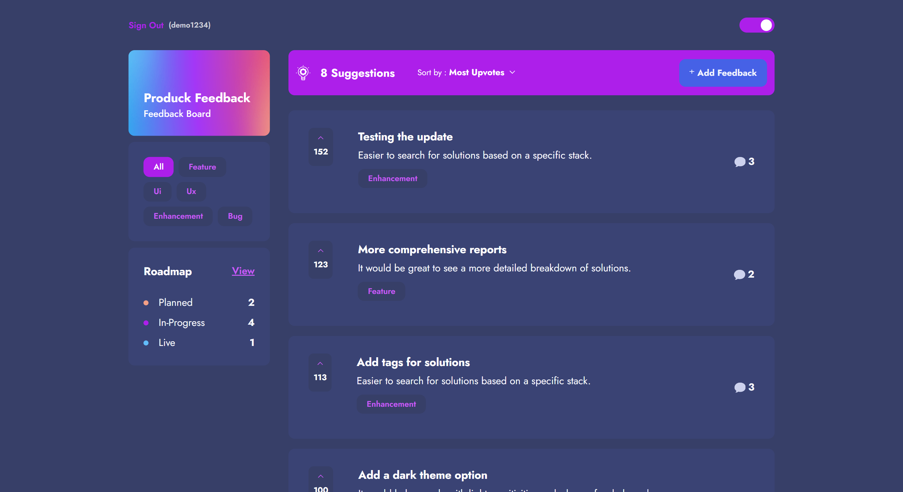

# Produck feedback app solution

This project is inspired by the [Product feedback app challenge on Frontend Mentor](https://www.frontendmentor.io/challenges/product-feedback-app-wbvUYqjR6).

## Table of contents

- [Overview](#overview)
  - [The challenge](#the-challenge)
  - [Screenshot](#screenshot)
  - [Links](#links)
- [My process](#my-process)
  - [Built with](#built-with)
  - [What I learned](#what-i-learned)
  - [Continued development](#continued-development)
  - [Useful resources](#useful-resources)
- [Author](#author)


## Overview

### Features

Users are be able to:

- View the optimal layout for the app depending on their device's screen size
- See hover states for all interactive elements on the page
- Create, read, update, and delete product feedback requests
- Receive form validations when trying to create/edit feedback requests
- Sort suggestions by most/least upvotes and most/least comments
- Filter suggestions by category
- Add comments and replies to a product feedback request
- Upvote product feedback requests


### Screenshot

### Screenshot of the sign-in page


### Screenshot of the home dashboard



### Links

- Solution URL: [Frontend mentor solution page](https://www.frontendmentor.io/solutions/productfeedbackappnextjs-nextauth-mongodb-tailwindcss-framerm-YogrL-fVRE)
- Live Site URL: [https://produck-feedback-app.vercel.app](https://produck-feedback-app.vercel.app)

## My process

### Built with

- Semantic HTML5 markup
- CSS custom properties
- Flexbox
- CSS Grid
- Mobile-first workflow
- [React](https://reactjs.org/) - JS library
- [Next.js](https://nextjs.org/) - React framework
- [Next-Auth](https://next-auth.js.org) - Next.js Authorization library
- [ReduxToolkit](https://nextjs.org/) - State managment tool
- [Framer Motion](https://www.framer.com/motion) - Animation Library
- [MongoDB](https://www.mongodb.com) - No SQL Database
- [MongooseJS](https://mongoosejs.com) = MongoDB Library
- [TailwindCSS](https://tailwindcss.com) - CSS utility class library.


### What I learned

I learn't a lot of different concepts working with next.js by building this project. For instance learning about different component types (server,client). 

I also learned about the different behaviours that can be used when rendering data and server components and the pros & cons of each way of rendering data and server components. The different ways we can handle data in server component are through Server Side Rendering(SSR), Static Site Generation(SSG) & Incremental Static Regeneration(ISG).

SSR - Is where we prerender the data and html content at build time on the server side and send the html content back to the client side fully ready to be displayed.

SSG - Is Similar to SSR but with a slight difference, with SSG we try to pre-render the different pages on the site in advance rather than build and render each page individually on the server each time we request a new page. This will speed up our application as we will already have the data and html content ahead of time, ready to display the page. We can even use tools like **generateStaticParams** to help us archieve this with pages that require dynamic data, like a product page that needs a specific id to grab data needed for that products page.

ISR - This allows us to incrementally call and refresh our page/data in order to prevent the data and html content from becoming stale and always makes sure our data/ page content is always fresh and up to date. (Allows components to be re-rendered when data changes)

By using and combining these concepts and knowing where, when, why and how to use them, we can see that next.js is a powerfull technology to use and there are all sorts of ways of handling our different use cases for different projects. For Example, by using the concepts mentioned above, we can give our site better SEO rankings in google because the site crawlers that index our site can check our pre-rendered html before it gets run on the client, where as if we just used a traditional SPA technologie like react on it's own, our site would have poor SEO Rankings because with SPA and client side rendering, the components, html content and javascript only get created at runtime on the browser/client, so when the bots crawl and try to index the site before this, they will only see an empty site without any elements and data and will there for give the site a poor SEO ranking.

Here is an example of **generateStaticParams** being used to fetch a list of feedback id's so we can pre-fetch the data required for each page in the list dynamicly before we request one of the pages.

```js
import { FeedbackBox } from "@/components/list-components";
import {
  AddComments,
  DetailsNav,
  FeedbackComments,
} from "@/components/detail-sections";
import { ThemeInit } from "@/components";
import getSingleFeedback from "@/lib/getSingleFeedback";
import { getServerSession } from "next-auth";
import { options } from "../../api/auth/[...nextauth]/options";
import { redirect } from "next/navigation";
import productRequests from "@/app/models/FeedbackSchema";
import { notFound } from "next/navigation";

export async function generateStaticParams() {
  // Couldn't call internal api here, instead had to call db directly
  const allFeedback = await productRequests.find({});
  return allFeedback.map((item) => ({
    id: item.id.toString(),
  }));
}

const Page = async ({ params: { id } }) => {
  const session = await getServerSession(options);
  const { data: currentFeedback } = await getSingleFeedback(id);
  //
  if (!session) {
    redirect("/auth/signin");
  }
  //
  if (!currentFeedback){
    return notFound()
  }
  //
  return (
    <main className="grid grid-cols-mob smTab:grid-cols-smTab pt-6 pb-20 lgTab:pt-14 lgTab:pb-32 lap:pt-20">
      <ThemeInit />
      <div className="w-full col-start-2 col-end-12 flex flex-col justify-start items-center gap-6 max-w-[730px] mx-auto">
        <DetailsNav {...currentFeedback} />
        <FeedbackBox {...currentFeedback} />
        <FeedbackComments {...currentFeedback} />
        <AddComments currentFeedback={currentFeedback} />
      </div>
    </main>
  );
};

export default Page;
```

### Continued development

This is only my second project using Next.js and I will continue to use it in more future projects to help practice and hone my knowledge with it, as I feel like I have only scratched the surface with what next.js can do.

In this project I also used next.js to build APIs and then used these to connect with the mongoDB database, and building APIs like these, with next seems like a streamlined and fun way of doing these, rather than setting up a traditional backend and I look forward to incorperating this kind of set up in the future.

I also plan on building more fullstack applications in the future and if I build them with NextJS, I will definitely be using them along side **Next-Auth** to implement the sign-up and login in functionality. I found Next-Auth to be relatively seemless to set-up and use. The amoumnt of customizability that is offers to create our own authorization and authentication for our project is extensive and should suit most needs. While it also gives us the ability to create sign-in features through a vast number of third party providers, such as google, github and a lot lot more. These reasons are why I will use Next-Auth again in future fallstack projects, and is a great way to implement these features when needed.

### Useful resources

- [Next.js Docs](https://nextjs.org/docs) - This helped me when building with next.js as there were many behaviours and concepts that I was not familiar before I started.

- [Dave Gray](https://www.youtube.com/playlist?list=PL0Zuz27SZ-6Pk-QJIdGd1tGZEzy9RTgtj) - I also used this course from dave gray on youtube to help me whenever I couldn't find what I was looking for in the next.js docs. It's very comprehensive and informative and covers a lot of the general concepts used in next.js 

- [Next-auth](https://next-auth.js.org/getting-started/introduction) - I referenced this a lot when setting up my project with next-auth.

- [ClarityCoders](https://www.youtube.com/watch?v=V6w64-_X9QU) - When I needed a bit of extra help on next-auth, I used this youtube tutorial to see this concepts in action and this video helped me a lot when using next-auth.

## Author

- Website - [djhwebdevelopment](https://www.djhwebdevelopment.com)
- Frontend Mentor - [@David-Henery4](https://www.frontendmentor.io/profile/David-Henery4)
- LinkedIn - [David Henery](https://www.linkedin.com/in/david-henery-725458241)


